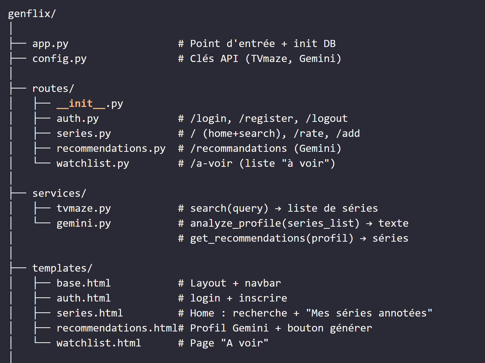
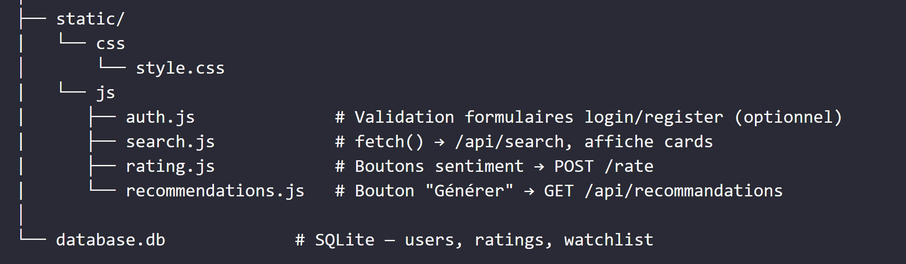

# Developpement-web
Projet sur le developpement web
Structure:

Methodes prevus:
app.py:
    from flask import Flask
    from config import SECRET_KEY, DATABASE
    from routes.auth import auth_bp
    from routes.series import series_bp
    from routes.recommendations import recommendations_bp
    from routes.watchlist import watchlist_bp
    import sqlite3

    def get_db():
        ...
    def init_db():
        ...
    def create_app():
        app = Flask(__name__)
        app.secret_key = SECRET_KEY
        init_db()
        app.register_blueprint(auth_bp)
        app.register_blueprint(series_bp)
        app.register_blueprint(recommendations_bp)
        app.register_blueprint(watchlist_bp)
        return app

    app = create_app()
    if __name__ == "__main__":
        app.run(debug=True, port=4000)

config.py:
    SECRET_KEY = "genflix_secret_key"
    DATABASE = "database.db"
    GEMINI_API_KEY = "ta_clé_gemini_ici"

routes/auth.py:
    from flask import Blueprint, session, g
    from app import get_db
    import functools

    auth_bp = Blueprint('auth', __name__)

    def login_required(f):
        ...
    @auth_bp.route('/login', methods=['GET', 'POST'])
    def login():
        ...
    @auth_bp.route('/register', methods=['GET', 'POST'])
    def register():
        ...
    @auth_bp.route('/logout')
    def logout():
        ...

routes/series.py:
    from flask import Blueprint
    from app import get_db
    from routes.auth import login_required
    from services.tvmaze import search_shows

    series_bp = Blueprint('series', __name__)
    @series_bp.route('/')
    @login_required
    def home():
        ...
    @series_bp.route('/api/search')
    @login_required
    def api_search():
        ...
    @series_bp.route('/rate', methods=['POST'])
    @login_required
    def rate():
        ...
    @series_bp.route('/add', methods=['POST'])
    @login_required
    def add_series():
        ...

routes/recommendations.py:
    from flask import Blueprint
    from app import get_db
    from routes.auth import login_required
    from services.gemini import analyze_profile, get_recommendations

    recommendations_bp = Blueprint('recommendations', __name__)

    @recommendations_bp.route('/recommandations')
    @login_required
    def recommendations_page():
        ...

    @recommendations_bp.route('/api/recommandations')
    @login_required
    def api_recommendations():
        ...

routes/watchlist.py:
    from flask import Blueprint
    from app import get_db
    from routes.auth import login_required

    watchlist_bp = Blueprint('watchlist', __name__)

    @watchlist_bp.route('/a-voir')
    @login_required
    def watchlist_page():
        ...

    @watchlist_bp.route('/a-voir/add', methods=['POST'])
    @login_required
    def add_to_watchlist():
        ...

    @watchlist_bp.route('/a-voir/remove', methods=['POST'])
    @login_required
    def remove_watchlist():
        ...

services/tvmaze.py:
    import requests
    def search_shows(query):
        ...
    def get_show_info(show_id):
        ...

services/gemini.py:
    import requests
    from config import GEMINI_API_KEY

    def analyze_profile(ratings_list):
        ...

    def get_recommendations(profile_text):
        ...

static/js/search.js:
    async function searchShows(query) {}
    function displayResults(shows) {}

static/js/rating.js:
    async function rateSeries(showId, sentiment) {}
    function updateRatingUI(showId, sentiment) {}

static/js/recommendations.js:
    async function generateRecommendations() {}
    function displayRecommendations(data) {}

static/js/auth.js:
    function validateForm() {}

